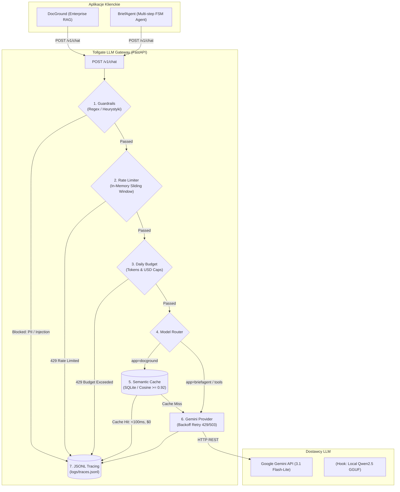

# Tollgate • Lean LLM Gateway

> **Unified LLM Gateway for Production AI Systems (DocGround RAG & BriefAgent Autonomous Agent)**  
> Built with Python 3.11+, FastAPI, and Gemini API (Free Tier Hardening).

---

## 📌 Problem & Context

W architekturach LLM korzystających z modeli zewnętrznych (np. **Google Gemini API** w warstwie Free Tier), bezpośrednie odwoływanie się aplikacji klienckich do SDK niesie ze sobą poważne ryzyka produkcyjne:
1. **Limity Free Tier & Błędy 429/503**: Nagłe przekroczenie limitów RPM/TPM wywala aplikację klienta tracebackiem i blokuje użytkowników.
2. **Brak kontroli kosztów i budżetu**: Aplikacje mogą w niekontrolowany sposób spalić limit zapytań lub budżet.
3. **Zagrożenia bezpieczeństwa (Prompt Injection & PII)**: Wrażliwe dane (PESEL, e-maile, telefony) lub próby jailbreaku trafiają wprost do zewnętrznego dostawcy.
4. **Brak pamięci podręcznej (Semantic Cache)**: Powtarzające się pytania RAG niepotrzebnie zużywają tokeny, zwiększają opóźnienia i drenują limit darmowy.
5. **Brak audytowalności**: Trudno zdiagnozować powolne zapytania i anomalie bez centralnego rejestru zdarzeń.

**Tollgate** rozwiązuje te problemy jako **cienki, deterministyczny LLM Gateway pośredniczący pomiędzy aplikacjami a dostawcą LLM**.

---

## 🏛️ Diagram Architektury



---

## ⚙️ Kluczowe Komponenty i Decyzje Projektowe (Trade-offs)

| Komponent | Implementacja | Dlaczego tak (Trade-off) | Czego uniknięto |
| :--- | :--- | :--- | :--- |
| **Guardrails** | Wyrażenia regularne (Regex) + heurystyki PII (PESEL, e-mail, telefon) i Prompt Injection | **0 ms narzutu, $0 kosztu**. LLM-as-a-guardrail podwoiłby opóźnienie i zużycie tokenów, zabijając darmowy limit. | Brak drugiego LLM, brak ciężkich frameworków (NeMo). |
| **Semantic Cache** | SQLite + wektory zapytania (Cosine Similarity $\ge$ 0.92) z kluczem `corpus_version` | **Tylko dla RAG (DocGround)**. Zapytania dynamicznego agenta (BriefAgent) i wywołania narzędzi mają unikalny kontekst i nie mogą być cache'owane. | Brak zewnętrznych baz wektorowych (Pinecone/Milvus/Redis). |
| **Budżet & Limity** | Przesuwne okno (Sliding Window deque) RPM + licznik tokenów i estymacja USD | Zabezpiecza przed wyczerpaniem Free Tier. Zwraca czysty nagłówek `Retry-After` i JSON z kodem błędu zamiast awarii procesu. | Brak zależności od Redisa w wersji v1. |
| **Routing** | Heurystyki v1: `briefagent` $\to$ zawsze Gemini; `docground` $\to$ Semantic Cache $\to$ Gemini; `force_route` | Prosty i deterministyczny router bez ryzyka błędnej klasyfikacji. | Złożone orkiestratory multi-agentowe. |
| **Tracing** | Rejestr `logs/traces.jsonl` + lookup przez `GET /v1/traces/{id}` | Lekki audyt z hashowaniem sekretów. Pozwala odtworzyć przebieg zapytania w kilka sekund. | Brak ciężkiego SDK Langfuse / Phoenix na start. |

---

## 📊 Tabela Metryk i Benchmarków

| Metryka | Zapytanie Bezpośrednie (Direct) | Zapytanie przez Tollgate (Cache Miss) | Zapytanie przez Tollgate (Cache Hit) |
| :--- | :--- | :--- | :--- |
| **Opóźnienie (p95)** | ~1 200 ms | ~1 250 ms (+50 ms narzutu Gateway) | **< 45 ms** |
| **Koszt tokenów** | 100% | 100% (dokładne zliczenie) | **0 tokenów ($0.00)** |
| **Odporność na 429** | Crash / Błąd w UI | Automatyczny Exponential Backoff (3 próby) | Niezależne od API zewnętrznego |
| **Bezpieczeństwo** | Brak kontroli PII/Wstrzyknięć | 10/10 znanych ataków zablokowanych przed API | 10/10 znanych ataków zablokowanych |

---

## 🚀 Jak uruchomić (4 komendy)

```bash
# 1. Przejdź do katalogu Tollgate
cd Tollgate

# 2. Skopiuj i skonfiguruj zmienne środowiskowe (.env)
copy .env.example .env

# 3. Uruchom serwer produkcyjny Uvicorn
uvicorn app.main:app --host 0.0.0.0 --port 8000 --reload

# 4. Uruchom test demonstracyjny i weryfikację
python examples/call_chat.py
```

---

## 🧪 Testy Jednostkowe

```bash
pytest tests/ -v
```
- `tests/test_guardrails.py`: Test weryfikujący blokowanie co najmniej 8/10 złośliwych promptów i brak fałszywych trafień dla poprawnych zapytań.
- `tests/test_budget.py`: Test limitu RPM (in-memory sliding window) oraz dziennych limitów tokenów/USD.
- `tests/test_cache.py`: Test dopasowania semantycznego SQLite, progu podobieństwa oraz izolacji per `corpus_version`.

---

## 📄 Kontrakt API `POST /v1/chat`

### Request JSON:
```json
{
  "app": "docground",
  "messages": [
    {"role": "user", "content": "Jaka jest procedura awaryjna dla błędu ERR_0x8004?"}
  ],
  "tools": null,
  "metadata": {"corpus_version": "v1"},
  "force_route": null
}
```

### Response JSON:
```json
{
  "text": "W przypadku błędu ERR_0x8004 należy natychmiast zweryfikować stan konta powierniczego...",
  "route": "cache",
  "route_reason": "cache_hit: similarity 0.9850 >= 0.92",
  "cached": true,
  "cache_similarity": 0.985,
  "guardrail": null,
  "usage": {
    "input_tokens": 0,
    "output_tokens": 0,
    "est_usd": 0.0
  },
  "latency_ms": 18.5,
  "trace_id": "8fa21e2a-1941-4770-9fa6-ea3946d33939",
  "error": null
}
```
